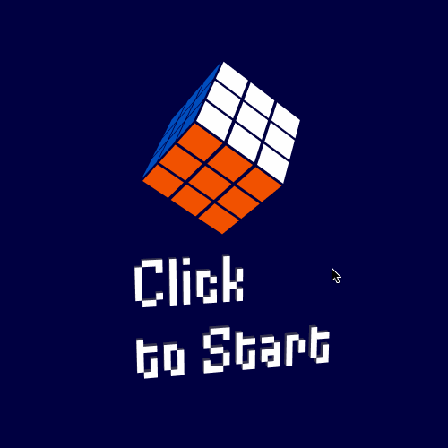

# Rubik's Cube

This is an implementation of the Rubik's cube puzzle in the Elm language using [WebGL](http://package.elm-lang.org/packages/elm-community/webgl/latest).

## Instructions to run

1. Install elm [elm-lang.org/install](http://elm-lang.org/install)
2. Clone this repo
3. Run `elm reactor`
4. Open [localhost:8000/src/Main.elm](http://localhost:8000/src/Main.elm) in the browser
